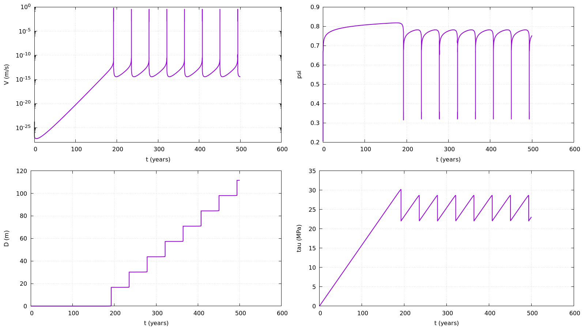

# Block Spring Slider

## Description


This is a toy model of a block spring slider following the Dieterich-Ruina aging law with a [PETSc](https://petsc.org/release/) time-stepper controller.
The aim of the project is to simply learn and understand the PETSc parameters and control for larger 2D and 3D models run by [tandem](https://github.com/TEAR-ERC/tandem?tab=readme-ov-file).


### Governing Equations


$\eta V = \tau - F(V, \psi) \sigma_{n}  $

$F(V, \psi) = a \cdot arcsinh(\frac{V}{2V_{0}} exp(\frac{\psi}{a}))$

Where:
- $V$ is the slider velocity $[\frac{m}{s}]$
- $V_{P}$ is the plate velocity $[\frac{m}{s}]$
- $V_0$ is a reference velocity $[\frac{m}{s}]$
- $\sigma_{n}$ is the effective normal stress $[Pa]$
- $k$ is the spring constant $[Pa/m]$
- $\tau$ is the shear stress $[Pa]$, given by $\tau = k (V_{P} t - D)$
- $\eta$ is the radiation damping coefficient $[\frac{kg}{m^2  s}]$

The state evolves following the Dieterich-Ruina aging law:
$\frac{d\psi}{dt} = \frac{b V_{0}}{L} (exp(\frac{f_{0} - \psi}{b}) - \frac{V}{V_{0}})$

Where:
- $L$ is a charecaristic slip distance $[m]$
- $f_0$ is refernce cofficent of friction
- $a$ and $b$ are rate and state cofficents


## Installation

To use this model:

1. First, install PETSc as described in the Tandem [docs](https://tandem.readthedocs.io/en/latest/getting-started/installation.html).
2. Clone this repository:
   ```bash
   $ git clone https://github.com/yohaimagen/spring_slider_RS.git
   $ cd spring_slider_RS
   ```
3. Declare PETSc variables:
   ```bash
   $ export PETSC_DIR={path to PETSc root directory}
   $ export PETSC_ARCH=arch-linux-c-opt
   ```

4. Compile the model:
   ```bash
   $ make
   ```


## Usage

You can run the model directly from the command line:
```bash
$ ./app V0 f0 a b eta L sn Vinit Vp k yield_point_init final_time output.txt
```
with the appropriate values.
where the `yield_point_init` paramter dictates the initial shear stress by:
$\tau_{init} = k * y_{init}$

The file `.petscrc` contains PETSc TS object [parameters](https://petsc.org/release/manualpages/TS/TSSetFromOptions/) that can be changed. 

## example
Runing the model with:
```bash
$ ./app 1e-06 0.6 0.015 0.02 4500000.0 0.1 50000000.0 1e-09 1e-08 500000 10 15768000000 out.txt
$ gnuplot plot.gp
```
should create the following results:

